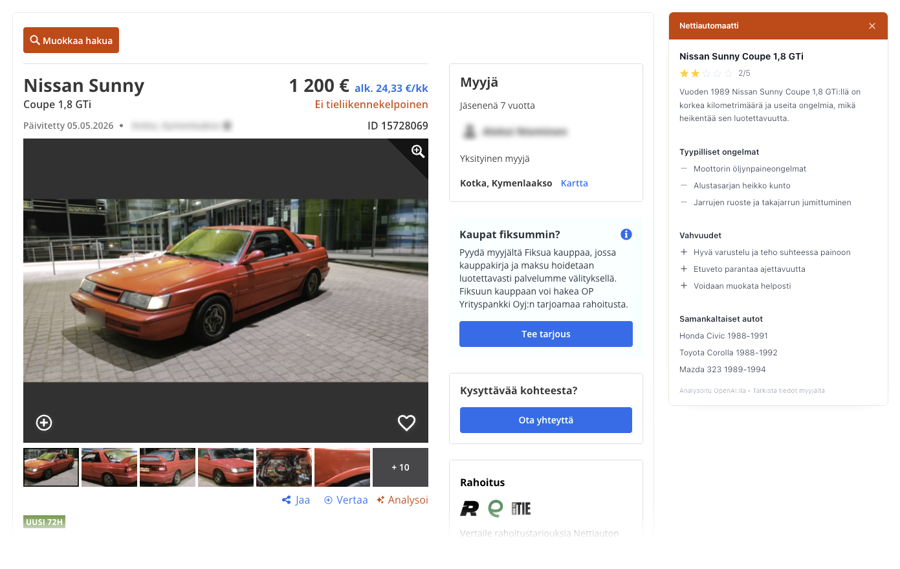

# Nettiautomaatti

Most used cars on nettiauto.fi look fine until they don't. This extension analyses any listing with one click and shows you the reliability score, known problems for that engine, and strengths before you drive two hours to see it.

Costs fractions of a cent per analysis.

---

## What you get

- Reliability score, summary, known problems and strengths for the exact engine and gearbox variant
- **NHTSA data** (USA, free, no key): official recall count, complaint count, and crash safety rating pulled live for the model year
- **Traficom data** (Finland, free, no key): recall campaign count for the model, with the listing's registration number ready to paste into takaisinkutsut.traficom.fi for a VIN-level check
- Seller description read critically: the AI flags concrete red flags instead of taking the marketing text at face value

---

## Setup

1. Clone the repo
2. Go to `chrome://extensions`, enable Developer mode
3. Load unpacked → select this folder
4. Click the extension icon, paste your OpenAI API key

You need an OpenAI account. Get a key at [platform.openai.com](https://platform.openai.com). Each analysis costs fractions of a cent.

---

## How it works

Scrapes the listing DOM (title, specs, mileage, engine, transmission, seller notes) and fetches NHTSA and Traficom recall data in parallel via background service worker. Builds a prompt with all of it. Sends to gpt-4o-mini. Renders in a panel injected into the page. Fetches NHTSA and Traficom recall data in parallel (via background service worker to bypass CORS). Builds a prompt with all of it. Sends to gpt-4o-mini. Renders in a panel injected into the page.

The Analysoi button sits next to Jaa and Vertaa in the toolbar. No popup, no new tab.

---

## Privacy

Listing data goes to OpenAI. Nothing else. API key lives in `chrome.storage.sync`.
